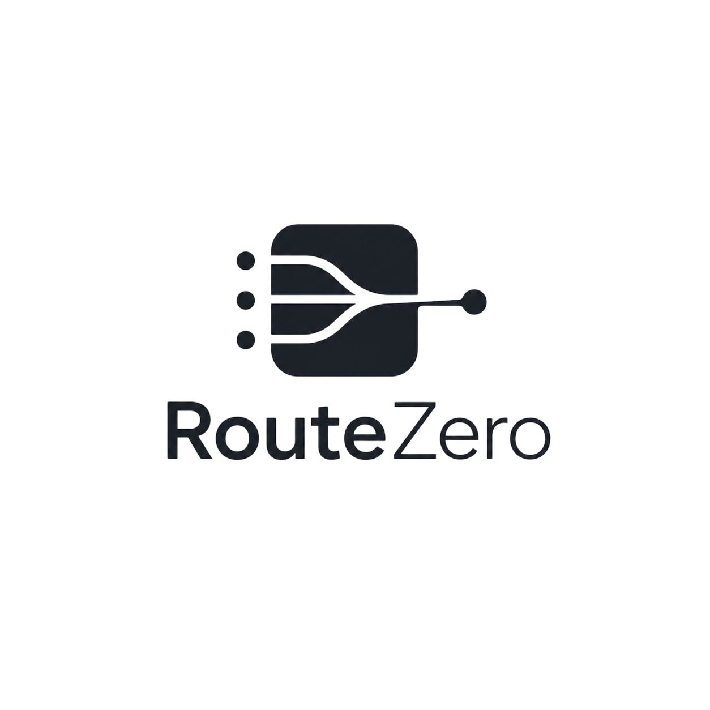

<p align="center">
  
</p>

# RouteZero

[](LICENSE)

A unified LLM routing proxy that aggregates multiple free-tier LLM providers behind a single OpenAI-compatible API endpoint. RouteZero automatically picks the best available model for each request, handles rate limits, and falls back gracefully when providers are exhausted.

This is a rework and extension of [FreeLLMAPI](https://github.com/tashfeenahmed/freellmapi) by Tashfeen Ahmed.

## Features

- **Single API endpoint** — OpenAI-compatible `/v1/chat/completions` for all providers
- **Auto-routing** — picks the best available model based on category (General, Coding, Researching)
- **Automatic failover** — if a model is rate-limited or down, falls through the chain
- **60+ free models** — across 17 providers (Google, Groq, Cerebras, Mistral, OpenRouter, and more)
- **Live provider catalog** — browse, compare benchmark ranks, filter by provider
- **Drag-and-drop fallback chain** — reorder model priority in the UI
- **Built-in rate limiting** — per-model RPM/RPD/TPM/TPD tracking with cooldown escalation
- **Analytics dashboard** — request volume, token usage, cost estimates, custom date ranges
- **API key management** — encrypted storage, bulk validation, export/import
- **Batch testing** — send the same prompt to multiple models simultaneously
- **Provider health status** — live RPM usage bars, cooldown alerts, key status
- **Vision / multimodal** — send images in chat, auto-routed to vision-capable models
- **Image generation** — `/v1/images/generations` endpoint routed to supported providers
- **Embeddings** — `/v1/embeddings` endpoint routed to supported providers
- **Dark/light theme** — persistent toggle
- **OpenAPI 3.1 docs** — interactive Swagger UI at `/api/openapi/docs`

## Quick Start

```bash
# Install dependencies
npm install

# Copy config (encryption key auto-generates in dev mode)
cp .env.example .env

# Build
npm run build

# Start
npm run dev
```

Open `http://localhost:5173` for the dashboard. The API listens on `http://localhost:3001`.

## Environment

| Variable             | Default | Description                                               |
| -------------------- | ------- | --------------------------------------------------------- |
| `DEV_MODE`           | `false` | Auto-generates encryption key if `ENCRYPTION_KEY` not set |
| `ENCRYPTION_KEY`     | —       | 64-char hex key for API key encryption (required in prod) |
| `PORT`               | `3001`  | Server port                                               |
| `DASHBOARD_ORIGINS`  | —       | Extra CORS origins for the dashboard                      |
| `LOG_RETENTION_DAYS` | `30`    | Days to keep request logs                                 |
| `WEBHOOK_URL`        | —       | POST URL for key expiry / 429 spike notifications         |

## Adding API Keys

1. Open the dashboard → **Keys** page
2. Add a key for each provider you want to use
3. The router will automatically discover enabled keys and use them in the fallback chain

The router requires at least one API key per platform. Some providers (Kilo, Pollinations, LLM7) accept anonymous requests — add a placeholder key (any non-empty string) to enable them.

## Using the API

```bash
curl http://localhost:3001/v1/chat/completions \
  -H "Authorization: Bearer $(curl -s http://localhost:3001/api/settings/api-key | jq -r .apiKey)" \
  -H "Content-Type: application/json" \
  -d '{
    "model": "auto",
    "messages": [{"role": "user", "content": "Hello!"}]
  }'
```

### Model field options

| Value                 | Behavior                                             |
| --------------------- | ---------------------------------------------------- |
| `"auto"` or omit      | General mode — sorted by intelligence rank           |
| `"auto:coding"`       | Coding mode — sorted by coding benchmark rank        |
| `"auto:researching"`  | Researching mode — sorted by research/reasoning rank |
| `"specific-model-id"` | Pin to a specific catalog model                      |

### Vision / multimodal

Send images in chat using the OpenAI `image_url` content block format. Images with base64 data URIs are forwarded to vision-capable providers (Google Gemini, OpenRouter vision models). The router automatically detects image content and selects a vision-capable model.

```bash
curl http://localhost:3001/v1/chat/completions \
  -H "Authorization: Bearer $(curl -s http://localhost:3001/api/settings/api-key | jq -r .apiKey)" \
  -H "Content-Type: application/json" \
  -d '{
    "model": "auto",
    "messages": [{
      "role": "user",
      "content": [
        {"type": "text", "text": "What is in this image?"},
        {"type": "image_url", "image_url": {"url": "data:image/png;base64,..."}}
      ]
    }]
  }'
```

### Image generation

```bash
curl http://localhost:3001/v1/images/generations \
  -H "Authorization: Bearer $(curl -s http://localhost:3001/api/settings/api-key | jq -r .apiKey)" \
  -H "Content-Type: application/json" \
  -d '{
    "model": "auto",
    "prompt": "A cat wearing a hat",
    "n": 1,
    "size": "1024x1024"
  }'
```

### Embeddings

```bash
curl http://localhost:3001/v1/embeddings \
  -H "Authorization: Bearer $(curl -s http://localhost:3001/api/settings/api-key | jq -r .apiKey)" \
  -H "Content-Type: application/json" \
  -d '{
    "model": "auto",
    "input": "Hello, world!"
  }'
```

## Architecture

```
┌─────────────┐     ┌──────────────┐     ┌─────────────────┐
│  Dashboard   │────▶│  RouteZero   │────▶│  Provider 1     │
│  (React SPA) │     │  Express API │     │  Provider 2     │
│  :5173       │     │  :3001       │     │  Provider 3     │
└─────────────┘     │  SQLite DB   │     │  ...            │
                    └──────────────┘     └─────────────────┘
```

- **Client**: React 19 + Vite 8 + Tailwind 4 SPA
- **Server**: Express 5 + better-sqlite3
- **Routing**: In-memory round-robin per platform + dynamic priority penalties on 429

## Terms of Service & Provider Compliance

RouteZero is a self-hosted, single-user, personal-use proxy. Each upstream provider has its own terms, summarized below (reviewed May 2026). This is informational, not legal advice.

| Provider                 | Verdict      | Notes                                                                                                                                                                 |
| ------------------------ | ------------ | --------------------------------------------------------------------------------------------------------------------------------------------------------------------- |
| Google Gemini            | ⚠️ Caution   | March 2026 ToS narrows scope to "professional or business purposes, not for consumer use" — a self-hosted developer proxy is still defensible, but the clause is new. |
| Groq                     | ✅ Likely OK | GroqCloud Services Agreement permits Customer Application integration.                                                                                                |
| Cerebras                 | ✅ Likely OK | Permitted; explicitly forbids selling/transferring API keys.                                                                                                          |
| Mistral                  | ✅ Likely OK | APIs allowed for personal/internal business use.                                                                                                                      |
| OpenRouter               | ✅ Likely OK | April 2026 ToS sharpens the no-resale / no-competing-service clause; private single-user proxy still fine.                                                            |
| SambaNova                | ⚠️ Ambiguous | EULA §1.5(c) blocks resale and "service bureau" use; single-user with no third-party access is fine.                                                                  |
| Cloudflare Workers AI    | ⚠️ Ambiguous | No anti-proxy clause; covered by general Self-Serve Subscription Agreement.                                                                                           |
| NVIDIA NIM               | ⚠️ Caution   | Trial ToS §1.2 / §1.4: "evaluation only, not production." Disabled in default catalog.                                                                                |
| GitHub Models            | ⚠️ Caution   | Free tier explicitly scoped to "experimentation" and "prototyping."                                                                                                   |
| Cohere                   | ❌ Avoid     | Terms §14 still forbids "personal, family or household purposes."                                                                                                     |
| Zhipu (open.bigmodel.cn) | ✅ Likely OK | Personal/non-commercial research carve-out still in the platform docs.                                                                                                |
| Z.ai (api.z.ai)          | ⚠️ Caution   | Singapore entity; §III.3(l) anti-traffic-redirect clause could plausibly be read against a proxy; no explicit personal-use carve-out.                                 |
| Ollama Cloud             | ✅ Likely OK | Free plan permits cloud-model access (1 concurrent, 5-hour session caps). No anti-proxy / anti-resale clauses found.                                                  |

Rules of thumb that keep most providers happy: one account per provider, no reselling, no sharing your endpoint with other humans, don't hammer a free tier as a paid production backend. This is informational, not legal advice — read each provider's ToS and make your own call.

## Disclaimer

This project is for personal experimentation and learning, not production. Free tiers exist so developers can prototype against them; they aren't a stable, supported inference substrate and shouldn't be treated as one. If you build something real on top of RouteZero, swap in a paid API before you ship. Your relationship with each upstream provider is governed by the terms you accepted when you created your account — those terms still apply when the traffic is proxied through this project, and you're responsible for complying with them.

## Credits

RouteZero is a rework of [FreeLLMAPI](https://github.com/tashfeenahmed/freellmapi) by Tashfeen Ahmed. The original project pioneered the concept of aggregating free-tier LLM providers behind a single API. RouteZero extends this with a full dashboard UI, auto-routing by benchmark category, expanded provider support, and additional operational features.

## License

[MIT](LICENSE) © 2026 M. İrfan Günel — based on original work © 2026 Tashfeen Ahmed
